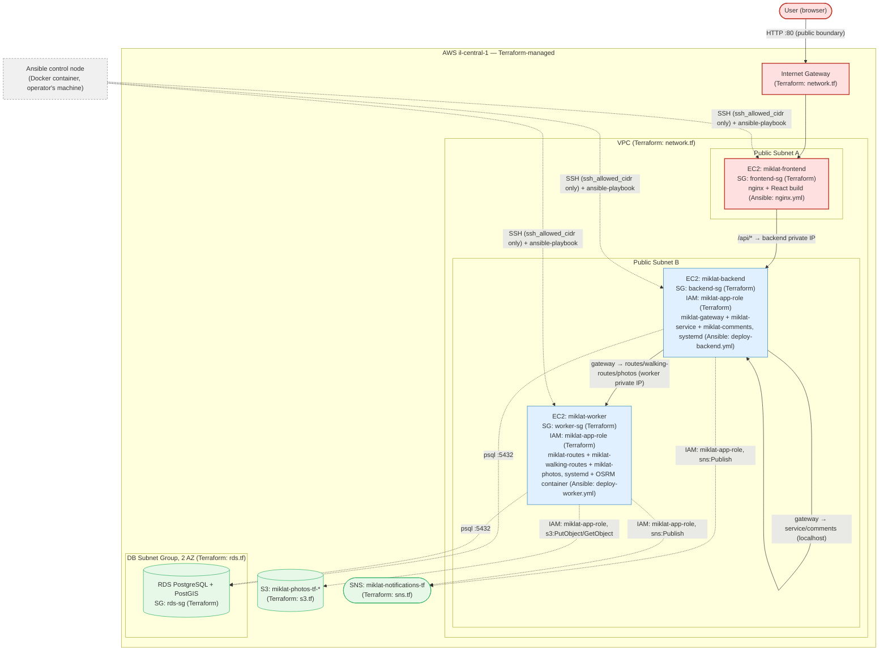

# Architecture Diagram — Task 2 (Terraform + Ansible)

Shows the AWS infrastructure created by Terraform, the software configured on top of it by
Ansible, traffic directions, and the separation between the two tools. Renders natively on
GitHub (Mermaid block below); a pre-rendered PNG is also included
(`architecture-task2.png`) for viewing outside GitHub.

Legend (color = zone):
- 🔴 **red** — public entry point (Internet, Internet Gateway, the frontend EC2's public interface on port 80).
- 🔵 **blue** — private application layer inside the VPC (backend/worker EC2, reachable only from specific Security Groups, never directly from the Internet).
- 🟢 **green** — managed AWS service (RDS, S3, SNS) — reached over the network/IAM, not part of any EC2.
- ⬜ **grey** — the Ansible control node (a Docker container on the operator's machine) — outside AWS, connects over SSH only, not part of the running application.

**Terraform vs Ansible, in one line:** every box inside the AWS boundary below (VPC, subnets, Internet Gateway, the 3 EC2 instances as empty shells, the 4 Security Groups, RDS, S3, SNS) is created by **Terraform** (`terraform/*.tf`). Everything running *inside* those EC2 instances (nginx, the Python services under systemd, the OSRM container) is installed and configured by **Ansible** (`ansible/playbooks/*.yml`) after Terraform hands off the bare instances — labeled on each node below.

