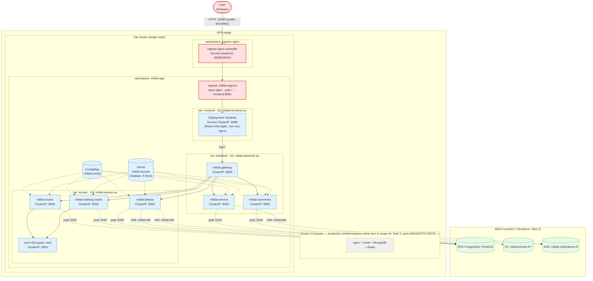

# Architecture Diagram — Task 3 (Kubernetes)

Deployment View: namespaces, Deployment/Service, Ingress, traffic boundaries and
public/private separation. Renders natively on GitHub (Mermaid block below); a
pre-rendered PNG is also included (`architecture-task3.png`) for viewing outside GitHub.

Legend (color = zone):
- 🔴 **red** — public zone (outside the cluster / outside the VPC): user, Ingress controller, Ingress resource.
- 🔵 **blue** — private zone inside the cluster (`ClusterIP` only, unreachable from outside): all 8 Deployment/Service, ConfigMap, Secret.
- 🟢 **green** — AWS cloud (Task 2, Terraform): RDS, S3, SNS — outside the cluster, reached over the network/IAM.
- ⬜ **grey dashed** — production `shelternearyou.online` on the same physical server `mbdai`, out of scope for this task, shown only for isolation context.

