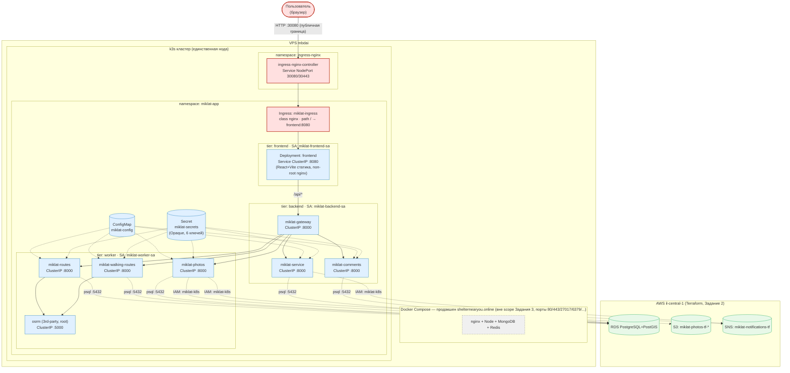

# Диаграмма архитектуры — Задание 3 (Kubernetes)

Deployment View: namespace'ы, Deployment/Service, Ingress, границы трафика и разделение
public/private. Рендерится нативно на GitHub (mermaid-блок ниже); альтернативно — готовый
PNG рядом (`architecture-task3.png`), на случай просмотра вне GitHub.

Легенда (цвет = зона):
- 🔴 **красный** — публичная зона (снаружи кластера/снаружи VPC): пользователь, Ingress-контроллер, Ingress-ресурс.
- 🔵 **синий** — приватная зона внутри кластера (только `ClusterIP`, недостижимо снаружи): все 8 Deployment/Service, ConfigMap, Secret.
- 🟢 **зелёный** — AWS-облако (Задание 2, Terraform): RDS, S3, SNS — вне кластера, доступ по сети/IAM.
- ⬜ **серый пунктир** — продакшен `shelternearyou.online` на том же физическом сервере `mbdai`, вне scope этого задания, показан только для контекста изоляции.

