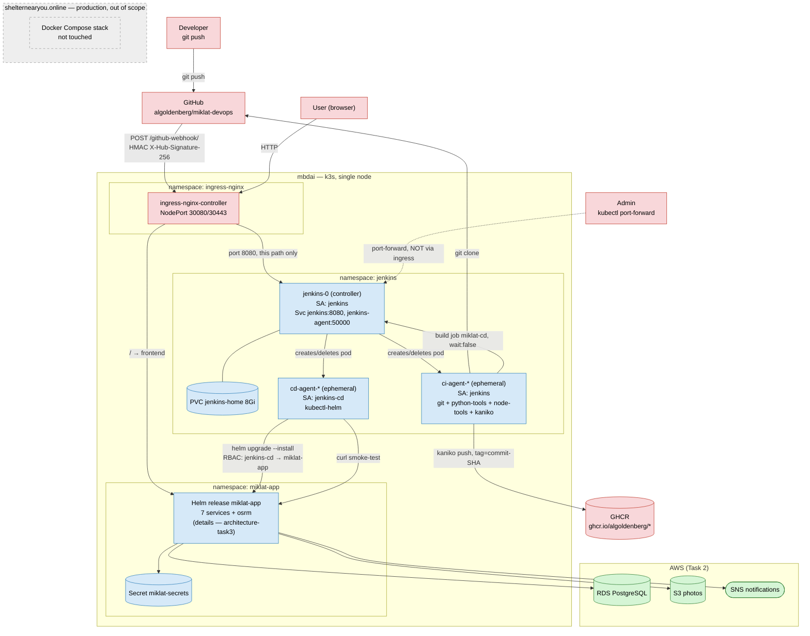
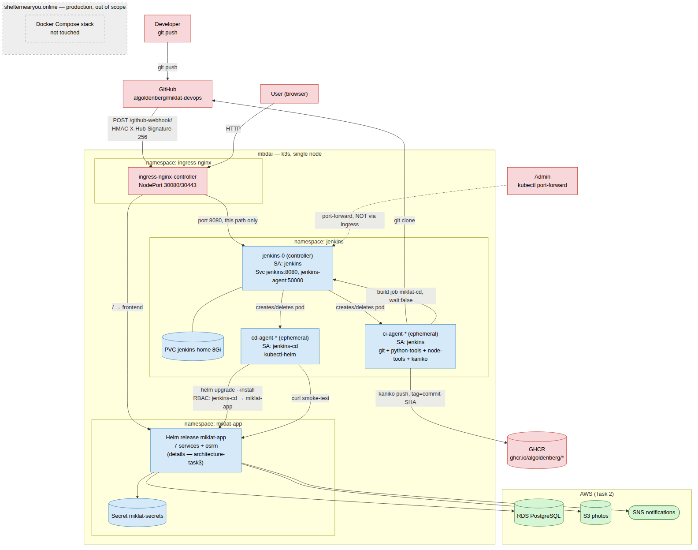
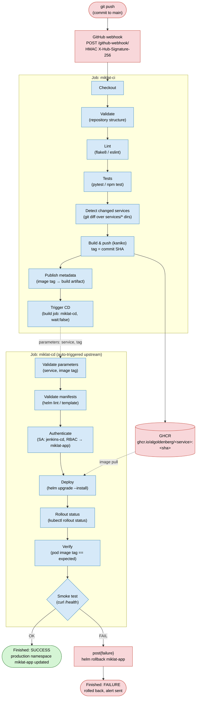
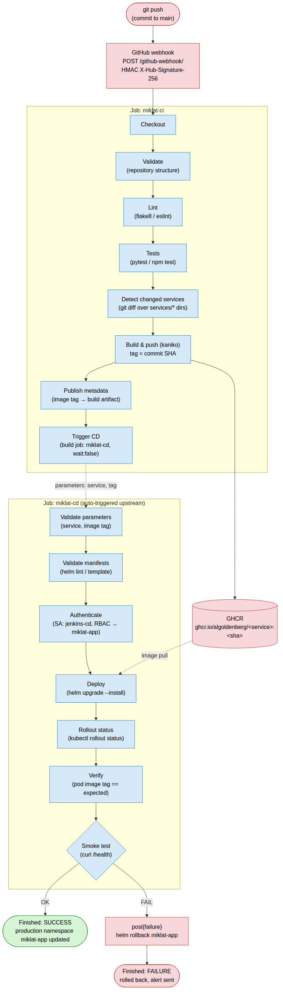

# Architecture — Task 4 (Jenkins CI/CD)

Two diagrams required for Task 4: **Deployment View** (where the Jenkins CI/CD components physically live relative to the rest of the `mbdai` cluster) and **Pipeline Flow** (how a commit turns into a deployed pod, including the rollback path on failure).

Both diagrams are Mermaid, so they render natively on GitHub. Pre-rendered PNGs (`task4-deployment.png`, `task4-pipeline.png`) sit alongside this file in case Mermaid isn't supported wherever this is viewed.

Color legend, shared with `architecture-task3.md`:

| Color | Meaning |
|---|---|
| 🔴 pink | public / external entry point (internet, webhook, image registry) |
| 🔵 blue | internal cluster component (Jenkins, Helm release, pods) |
| 🟢 green | managed AWS service (Task 2) / successful outcome |
| ⬜ grey (dashed) | out of scope for this architecture (production original) |

---

## 1. Deployment View

Shows where the Jenkins CI/CD components (namespace `jenkins`) physically sit relative to `ingress-nginx`, the application (`miklat-app`, details in `architecture-task3.md`), AWS services, and the production stack that stays untouched.

Key points visible on the diagram:

- The Jenkins controller (`jenkins-0`) is the only long-lived pod in namespace `jenkins`; agents (`ci-agent-*`, `cd-agent-*`) are ephemeral and created/deleted by the controller for every build.
- The only external path into Jenkins is `POST /github-webhook/` through `ingress-nginx`; everything else (`/login`, `/manage`, `/`) on the same Ingress falls through to the `miklat-app` frontend (confirmed in Step 7 via the `X-Jenkins` response header — see the README Security section).
- `ci-agent-*` runs as ServiceAccount `jenkins` with no cluster API permissions; `cd-agent-*` runs as a separate ServiceAccount `jenkins-cd`, scoped only to namespace `miklat-app`.
- Admin access to the Jenkins UI is only via `kubectl port-forward`, never through Ingress.
- The production stack (`shelternearyou.online`) physically runs on the same server (`mbdai`) but is entirely outside the scope of this cluster/Jenkins — no CI/CD component touches it.

---

## 2. Pipeline Flow

Shows the full path of a commit: from `git push` to rollout in `miklat-app`, including the happy path and the rollback on a failed smoke test.

Key points:

- `miklat-ci` and `miklat-cd` are separate Jenkins jobs; they're linked not by a webhook or polling but by a direct `build job: 'miklat-cd', wait: false` call at the end of `miklat-ci` (confirmed by a real end-to-end run in Step 6 — commit `742153e` → `miklat-photos` build → `miklat-cd` build #13 auto-triggered with matching parameters).
- `wait:false` means `miklat-ci` does not block waiting for `miklat-cd` — the job is marked successful as soon as `miklat-cd` is queued.
- Rollback (`helm rollback`) lives in the `post{failure}` block of `Jenkinsfile-cd`; it only fires if the smoke test fails, not on any deployment error (which is already caught by the earlier `Deploy`/`Rollout status` stages).
- Images in GHCR are tagged with the commit SHA, not `latest` — this is what makes rollback possible: the previous tag stays available in the registry.
