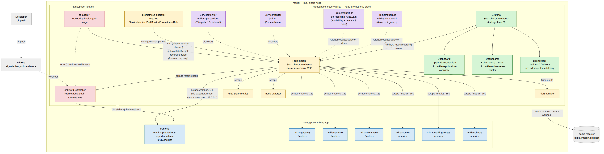

# Architecture — Task 5 (Prometheus + Grafana Monitoring)

One diagram for Task 5: the observability layer (`namespace: observability`, `kube-prometheus-stack`) wired into the two existing surfaces from Tasks 3-4 — the application (`namespace: miklat-app`) and CI/CD (`namespace: jenkins`) — plus the CD post-deploy health gate that closes the loop back into `jenkins`.

Mermaid, so it renders natively on GitHub. A pre-rendered PNG (`task5-monitoring.png`) sits alongside this file in case Mermaid isn't supported wherever this is viewed.

Color legend:

| Color | Meaning |
|---|---|
| 🔵 blue | application component (`miklat-app`) |
| 🟠 orange | observability core (Prometheus, Alertmanager, exporters, operator) |
| 🟣 purple | Observability-as-Code objects (ServiceMonitor/PodMonitor, PrometheusRule) |
| 🟢 green | Grafana + the 3 required dashboards |
| 🔴 pink | Jenkins CI/CD component (`namespace: jenkins`) |
| ⬜ grey | external (developer, GitHub, Alertmanager demo receiver) |

---

```mermaid
flowchart TB
    DEV["Developer<br/>git push"]
    GH["GitHub<br/>algoldenberg/miklat-devops"]

    subgraph MBDAI["mbdai — k3s, single node"]
        subgraph NS_APP["namespace: miklat-app"]
            SVC1["frontend<br/>+ nginx-prometheus-exporter sidecar<br/>:9113/metrics"]
            SVC2["miklat-gateway<br/>/metrics"]
            SVC3["miklat-service<br/>/metrics"]
            SVC4["miklat-comments<br/>/metrics"]
            SVC5["miklat-routes<br/>/metrics"]
            SVC6["miklat-walking-routes<br/>/metrics"]
            SVC7["miklat-photos<br/>/metrics"]
        end

        subgraph NS_JENKINS["namespace: jenkins"]
            JCTRL["jenkins-0 (controller)<br/>Prometheus plugin /prometheus"]
            CDAGENT["cd-agent-*<br/>Monitoring health gate stage"]
        end

        subgraph NS_OBS["namespace: observability — kube-prometheus-stack"]
            PROM["Prometheus<br/>Svc kube-prometheus-stack-prometheus:9090"]
            GRAF["Grafana<br/>Svc kube-prometheus-stack-grafana:80"]
            AM["Alertmanager"]
            KSM["kube-state-metrics"]
            NE["node-exporter"]
            OPER["prometheus-operator<br/>watches ServiceMonitor/PodMonitor/PrometheusRule"]

            SM["ServiceMonitor<br/>miklat-app-services<br/>(7 targets, 15s interval)"]
            SMJ["ServiceMonitor<br/>jenkins<br/>(/prometheus)"]
            RULES["PrometheusRule<br/>slo-recording-rules.yaml<br/>(availability + latency, 9 rules)"]
            ALERTS["PrometheusRule<br/>miklat-alerts.yaml<br/>(6 alerts, 4 groups)"]

            DASH1["Dashboard:<br/>Application Overview<br/>uid: miklat-application-overview"]
            DASH2["Dashboard:<br/>Kubernetes / Cluster<br/>uid: miklat-kubernetes-cluster"]
            DASH3["Dashboard:<br/>Jenkins & Delivery<br/>uid: miklat-jenkins-delivery"]
        end
    end

    WEBHOOK[("demo receiver<br/>https://httpbin.org/post")]
    AM -->|route.receiver: demo-webhook| WEBHOOK

    DEV -->|git push| GH
    GH -.->|webhook| JCTRL

    OPER -->|configures scrape jobs| PROM
    SM -.->|discovers| PROM
    SMJ -.->|discovers| PROM
    PROM -->|"scrape /metrics, 15s<br/>(via exporter, reads stub_status over 127.0.0.1)"| SVC1
    PROM -->|scrape /metrics, 15s| SVC2
    PROM -->|scrape /metrics, 15s| SVC3
    PROM -->|scrape /metrics, 15s| SVC4
    PROM -->|scrape /metrics, 15s| SVC5
    PROM -->|scrape /metrics, 15s| SVC6
    PROM -->|scrape /metrics, 15s| SVC7
    PROM -->|scrape /prometheus| JCTRL
    PROM -->|scrape| KSM
    PROM -->|scrape| NE

    RULES -.->|"ruleNamespaceSelector: all ns"| PROM
    ALERTS -.->|"ruleNamespaceSelector: all ns"| PROM
    PROM -->|firing alerts| AM

    GRAF -->|"PromQL (uses recording rules)"| PROM
    GRAF --> DASH1
    GRAF --> DASH2
    GRAF --> DASH3

    CDAGENT -->|"curl (NetworkPolicy-allowed)<br/>up / availability / p95 recording rules<br/>(frontend: up only)"| PROM
    CDAGENT -.->|"error() on threshold breach"| JCTRL
    JCTRL -->|"post{failure}: helm rollback"| NS_APP

    classDef app fill:#d6e9f8,stroke:#2c7fb8,color:#000;
    classDef obs fill:#fff3cd,stroke:#b8860b,color:#000;
    classDef rule fill:#e6d6f8,stroke:#7b2cbf,color:#000;
    classDef dash fill:#d5f5d5,stroke:#2e7d32,color:#000;
    classDef jenkins fill:#f8d7da,stroke:#c0392b,color:#000;
    classDef ext fill:#eeeeee,stroke:#999999,color:#000;

    class SVC1,SVC2,SVC3,SVC4,SVC5,SVC6,SVC7 app;
    class PROM,AM,KSM,NE,OPER obs;
    class SM,SMJ,RULES,ALERTS rule;
    class DASH1,DASH2,DASH3,GRAF dash;
    class JCTRL,CDAGENT jenkins;
    class DEV,GH,WEBHOOK ext;
```

Key points visible on the diagram:

- `observability` is a separate namespace from both `miklat-app` and `jenkins` — Prometheus reaches into both via `ServiceMonitor`/`PodMonitor` objects (discovery, no manual target list) and `NetworkPolicy` explicitly allows each real scrape path (application services, Jenkins `/prometheus` endpoint, kube-state-metrics, node-exporter).
- `ruleNamespaceSelector: {}` on the Prometheus Operator means `PrometheusRule` objects are picked up from any namespace without a matching label — both the recording-rule group and the alert group live in `monitoring/`, not inside `observability`'s own manifests, and are still loaded.
- SLO recording rules (`slo-recording-rules.yaml`) are the single source of truth for availability/latency math — both the Grafana dashboards and the CD health-gate query the *same* recorded series (`job:http_request_availability:ratio5m`, `job:http_request_duration_highr_seconds:p95_5m`), not duplicated PromQL.
- `frontend` (nginx) has no application-level `/metrics` — instead a `nginx-prometheus-exporter` sidecar in the same pod (added 04.09.2026) reads nginx's `stub_status` over loopback (`127.0.0.1`, not exposed outside the pod) and exposes `/metrics` on port `9113`, scraped by the same `ServiceMonitor` as the 6 backend services (by port name, not number — `frontend`'s Service is the only one with named ports). It only provides `up` plus nginx connection/request counters — no per-request latency histogram (that's `prometheus-fastapi-instrumentator`, present only in the 6 Python backends) — so the CD health gate checks only `up` for `frontend`, not availability/p95.
- The CD health gate (`cd-agent-*`, Jenkinsfile-cd, added in Task 5 п.7) is the only component that closes the loop back from monitoring into CI/CD: it queries Prometheus after every deploy and calls `error()` on a threshold breach, which triggers the pre-existing `post{failure}` `helm rollback` — no new rollback logic was needed.
- `NetworkPolicy` in this cluster genuinely enforces egress, not just declaratively — confirmed twice: the Jenkins JNLP-port incident (Task 4) and, while wiring up the `nginx-prometheus-exporter` above (04.09.2026), `allow-prometheus-egress` initially allowed only port `8000` (the 6 backends) and silently blocked Prometheus's scrape of the new exporter's port `9113` (`connection refused`, while ordinary pod-to-pod traffic on that port worked fine) until the rule was updated.
- Alertmanager's receiver (`demo-webhook` → `https://httpbin.org/post`) is a safe demo endpoint, not a real paging channel — chosen deliberately so no real secrets/webhook URLs need to live in the repo for this project's routing to be demonstrable.
- `kubectl port-forward` (used throughout Task 5 for verification) is a manual, human-only access path — no automatic part of the system (scraping, dashboard provisioning, alert evaluation) depends on it being active. Neither Prometheus nor Grafana is exposed via Ingress.
